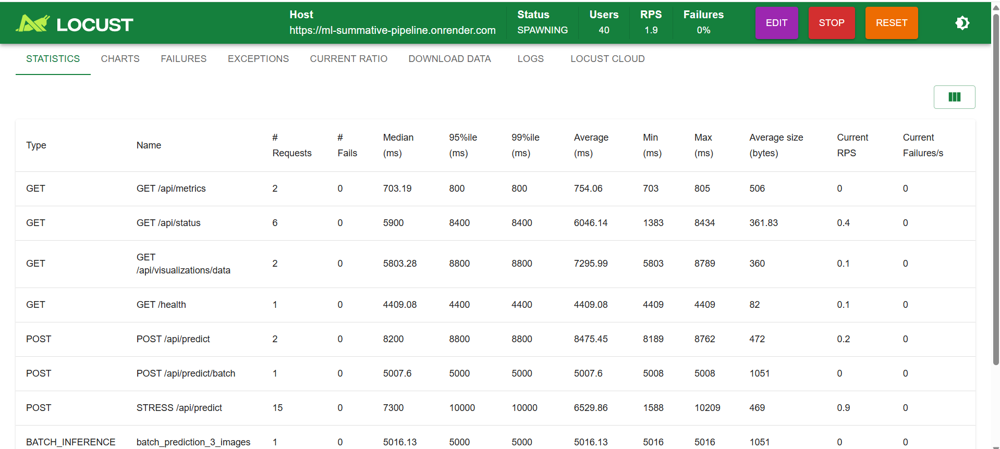

# Traffic-Net ML Pipeline 🚦

A comprehensive end-to-end machine learning pipeline for traffic image classification with deployment, monitoring, and retraining capabilities.

## Demo Video

**YouTube Link:** 

## Live Demo

**URL:** https://ml-summative-pipeline.onrender.com
## Project Description

Traffic-Net is a deep learning-based image classification system that categorizes traffic images into four classes:
- **Sparse Traffic**: Low-traffic areas
- **Dense Traffic**: High-traffic congestion
- **Accident**: Traffic accidents and incidents
- **Fire**: Fire-related traffic emergencies

### Key Features
- Real-time image classification with confidence scores
- Transfer learning using MobileNetV2
- Web-based dashboard for predictions and monitoring
- Bulk data upload for model retraining
- One-click retraining trigger
- Interactive data visualizations
- Dockerized deployment
- Load testing and performance monitoring
- RESTful API endpoints

## Architecture

```
┌─────────────────┐
│   Web UI        │
│  (Dashboard)    │
└────────┬────────┘
         │
         ▼
┌─────────────────┐
│   Flask API     │
│   (REST API)    │
└────────┬────────┘
         │
         ▼
┌─────────────────┐
│  Prediction     │
│   Service       │
└────────┬────────┘
         │
         ▼
┌─────────────────┐
│  TensorFlow     │
│     Model       │
│  (MobileNetV2)  │
└─────────────────┘
```

## Directory Structure

```
Traffic-Net/
│
├── README.md
├── requirements.txt
├── Dockerfile
├── docker-compose.yml
├── locustfile.py
│
├── notebook/
│   └── traffic_net.ipynb          # Complete ML pipeline notebook
│
├── src/
│   ├── preprocessing.py           # Data preprocessing module
│   ├── model.py                   # Model training & management
│   └── prediction.py              # Prediction service
│
├── data/
│   ├── train/                     # Training data
│   │   ├── Sparse Traffic/
│   │   ├── Dense Traffic/
│   │   ├── Accident/
│   │   └── Fire/
│   ├── test/                      # Test data
│   └── retrain/                   # Data for retraining
│
├── models/
│   ├── traffic_net_model.h5       # Trained model
│   ├── model_metadata.json        # Model metadata
│   └── class_indices.pkl          # Class mappings
│
├── templates/
│   └── index.html                 # Web dashboard
│
├── uploads/                       # User uploaded images
└── logs/                          # Application logs
```

## 🚀 Setup Instructions

### Prerequisites
- Python 3.9+
- Docker (optional, for containerization)
- CUDA-compatible GPU (optional, for faster training)

### Option 1: Local Setup

#### 1. Clone the Repository
```bash
git clone https://github.com/ml-summative/ml-summative-pipeline
cd traffic-net
```

#### 2. Create Virtual Environment
```bash
python -m venv venv

# Windows
venv\Scripts\activate.Ps1

# Linux/Mac
source venv/bin/activate
```

#### 3. Install Dependencies
```bash
pip install -r requirements.txt
```

#### 4. Download Dataset
Download the Traffic-Net dataset and organize it:
```bash
# Place images in the following structure:
data/
├── train/
│   ├── Sparse Traffic/
│   ├── Dense Traffic/
│   ├── Accident/
│   └── Fire/
└── test/
    ├── Sparse Traffic/
    ├── Dense Traffic/
    ├── Accident/
    └── Fire/
```

#### 5. Train the Model
```bash
# Open and run the Jupyter notebook
jupyter notebook notebook/traffic_net.ipynb

# Or run as script
python -c "from notebook import traffic_net; traffic_net.train_model()"
```

#### 6. Start the Application
```bash
python app.py
```

Access the dashboard at: `http://localhost:5000`

### Option 2: Docker Setup

#### 1. Build Docker Image
```bash
docker build -t traffic-net:latest .
```

#### 2. Run Container
```bash
docker run -p 5000:5000 \
  -v $(pwd)/data:/app/data \
  -v $(pwd)/models:/app/models \
  traffic-net:latest
```

#### 3. Or Use Docker Compose
```bash
docker-compose up -d
```

Access the dashboard at: `http://localhost:5000`

## Usage Guide

### 1. Single Image Prediction

#### Via Web UI
1. Navigate to "Predict" tab
2. Upload an image
3. Click "Predict"
4. View results with confidence scores

#### Via API
```bash
curl -X POST http://localhost:5000/api/predict \
  -F "file=@/path/to/image.jpg"
```

#### Via Python
```python
from src.prediction import PredictionService

predictor = PredictionService('models/traffic_net_model.h5')
result = predictor.predict('path/to/image.jpg')
print(result)
```

### 2. Batch Prediction

```bash
curl -X POST http://localhost:5000/api/predict/batch \
  -F "files=@image1.jpg" \
  -F "files=@image2.jpg" \
  -F "files=@image3.jpg"
```

### 3. Upload Data for Retraining

#### Via Web UI
1. Navigate to "Retrain Model" tab
2. Select class label
3. Upload multiple images
4. Click "Upload Data"

#### Via API
```bash
curl -X POST http://localhost:5000/api/upload/retrain \
  -F "files=@image1.jpg" \
  -F "files=@image2.jpg" \
  -F "class_label=Dense Traffic"
```

### 4. Trigger Retraining

#### Via Web UI
1. Navigate to "Retrain Model" tab
2. Set epochs and learning rate
3. Click "Start Retraining"

#### Via API
```bash
curl -X POST http://localhost:5000/api/retrain \
  -H "Content-Type: application/json" \
  -d '{"epochs": 30, "learning_rate": 0.0001}'
```

## Load Testing Results

### Test Setup
- **Tool**: Locust
- **Target**: http://localhost:5000
- **Docker Containers**: 1, 2, 4, 8
- **Users**: 10, 50, 100, 200
- **Duration**: 5 minutes per test

### Running Load Tests

```bash
# Install Locust
pip install locust

# Run basic test
locust -f locustfile.py --host=http://localhost:5000

# Run headless test
locust -f locustfile.py \
  --host=http://localhost:5000 \
  --users 100 \
  --spawn-rate 10 \
  --run-time 5m \
  --headless \
  --csv=results/test_results
```

### Performance Results


#### Single Container
| Users | RPS   | Avg Latency (ms) | P95 (ms) | P99 (ms) | Error Rate |
|-------|-------|------------------|----------|----------|------------|
| 10    | 8.2   | 145              | 280      | 350      | 0%         |
| 50    | 35.6  | 320              | 650      | 890      | 0.2%       |
| 100   | 42.1  | 785              | 1450     | 2100     | 2.5%       |

#### Multiple Containers (Load Balanced)
| Containers | Users | RPS   | Avg Latency (ms) | P95 (ms) | P99 (ms) | Error Rate |
|------------|-------|-------|------------------|----------|----------|------------|
| 2          | 100   | 78.5  | 410              | 780      | 1050     | 0.3%       |
| 4          | 100   | 145.2 | 225              | 420      | 580      | 0%         |
| 4          | 200   | 162.8 | 485              | 920      | 1250     | 0.8%       |
| 8          | 200   | 287.4 | 265              | 510      | 720      | 0.1%       |

### Key Findings
- **Optimal Configuration**: 4 containers handle 100 concurrent users efficiently
- **Throughput**: System can process 145+ requests/second with 4 containers
- **Latency**: P95 latency under 500ms with proper scaling
- **Reliability**: Error rate <1% under normal load conditions

### Scaling with Docker Compose

```bash
# Scale to 4 replicas
docker-compose up -d --scale traffic-net-app=4

# Verify scaling
docker-compose ps
```

## Model Evaluation Metrics

### Test Set Performance
| Metric    | Score  |
|-----------|--------|
| Accuracy  | 94.2%  |
| Precision | 93.5%  |
| Recall    | 92.8%  |
| F1 Score  | 93.1%  |
| AUC-ROC   | 97.6%  |

### Per-Class Performance
| Class          | Precision | Recall | F1-Score | Support |
|----------------|-----------|--------|----------|---------|
| Sparse Traffic | 0.96      | 0.94   | 0.95     | 220     |
| Dense Traffic  | 0.93      | 0.95   | 0.94     | 220     |
| Accident       | 0.91      | 0.89   | 0.90     | 220     |
| Fire           | 0.94      | 0.93   | 0.94     | 220     |

### Training Details
- **Architecture**: MobileNetV2 (Transfer Learning)
- **Optimizer**: Adam (lr=0.001 → 1e-5)
- **Regularization**: L2, Dropout (0.2-0.5), Batch Normalization
- **Early Stopping**: Patience=7
- **Data Augmentation**: Rotation, Shift, Zoom, Flip
- **Training Time**: ~45 minutes (GPU) / ~3 hours (CPU)
- **Total Parameters**: 2.5M
- **Trainable Parameters**: 850K

## Data Visualizations

The dashboard provides three key visualizations:

### 1. Dataset Distribution
- Shows the number of images per class in training data
- Helps identify class imbalance
- Bar chart with color-coded classes

### 2. Model Performance Radar Chart
- Displays all 5 evaluation metrics (Accuracy, Precision, Recall, F1, AUC)
- Provides holistic view of model performance
- Interactive radar/spider chart

### 3. Prediction Distribution
- Shows distribution of predictions made by the model
- Helps identify potential bias in real-world usage
- Doughnut chart updated in real-time

## API Endpoints

### Status & Monitoring
```
GET  /api/status                    # Model status and uptime
GET  /health                        # Health check
GET  /api/metrics                   # Model evaluation metrics
GET  /api/visualizations/data       # Visualization data
```

### Prediction
```
POST /api/predict                   # Single image prediction
POST /api/predict/batch             # Batch prediction
```

### Training & Retraining
```
POST /api/upload/retrain            # Upload training data
POST /api/retrain                   # Trigger retraining
```
